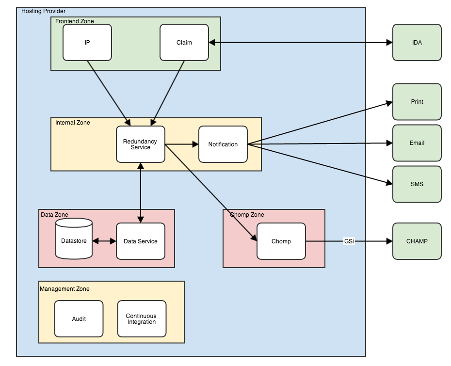

RPS Beta Prospective Architecture
=================================

Note that this is based on findings as of week 2 of the Alpha project and is subject to change as the alpha progresses.  Much of this information is assumed based on previous projects risk profiles, and is also subject to change based on discussion with a CLAS consultant and the SRO.

High level Architecture
-----------------------

The operating service will consist of a number of interacting services.  These will each run on seperate servers on the system and will be appropriately hosted according to the security concerns.
The main system will be the citizen facing service (Claim), which will present uses with the appropriate forms to start, save, continue and reconcile a claim for redundency payments.  This will cover each part of making a claim, including the current RP1 and RP2 parts of the claim process.

There will also be an IP Facing service (IP), which will provide a TurnKey upload facility, along with a manual upload form for the entering of employer colaborating evidence (the current RP14 and RP14A data).

The Services will communicate with the Redundancy Service, which is responsible for storing the claim data in the secure datastore, and for performing matching algorithms between the Claimant and the IP provided data.

The Redundancy Service will communicate with the Chomp Service, which in turns passes on data into the existing Champ system in the appropriate format.   The Redundancy Service will also communicate with the Notifier Service, which will pass on notifications via email, text or letter to the Clients or IP's as appropriate.

Each service will be monitored by a protective monitoring solution, which will store audit and transaction logs and ship them from the relevant service to the management service.

Each service will itself be run in a "shared nothing" horizontal architecture, with multiple instances of the server, and any data needing to be shared between the service stored in a local simple datastore.  This architecture will be primarily hosted as a number of running serivce applications, and a load balancer spliting the traffic between the service.

System upgrades will be performed on a per service manner, with the new software being started as a new server, and inserted into the load balancer.  The old service proceses will then be shutdown, leaving just the new system running.  This ensures that services can be deployed in a safe, rollback compatible way with no downtime.

We will ensure that changes to the communications protocols between the services are only changed in backwards compatible ways, which means that any single deployment is safe, and only needs to address a single server.

Hosting
-------

We believe at this time that the risk posed by the information stored will probably be compatible with OFFICAL hosting at the assured level (Pre April 2014 equivalent to Business Impact Level 2 hosting).  With the withdrawal of GPG-9's impact level increase by aggregation guidance, we believe that the appropriate security measures to put in place are:

 * Each service will be monitored to GPG-13 level of DETER, with audit logs being shipped off machine
 * The services will be divided into 5 security zones
    * the frontend zone (Claim and IP systems), 
    * the internal zone (Redundency, Notifications), 
    * the chomp zone (Chomp), 
    * the data zone which contains only the datastore.  
    * the management zone, which contains the audit logs.
 * Communication from the internet will be firewalled to only enter the frontend zone, and only on permitted internet ports.
 * Communications between the zones will be restricted to only approved communication between services we expect to communicate (frontend to internal, internal to data, internal out to internet)
 * Access to the management zone will be restricted to operations staff who are appropriately security cleared.

There is a concern about the bank account data provided by the claimant and how it will be stored.
At the moment the plan is to use public key encryption to protect the data until it is needed.  We plan to encrypt the data in the Claim service, extracting some masked information suitable for displaying to end users.  The encrypted data will be stored in the datastore by the Redundancy Service, neither of which will have capability to decrypt the data.

Because of the historical nature of Champ, the Chomp Service will have the ability to decrypt the payment data and pass it onto Champ in the form the current system expects.  A potential improvement in the future would be for the payment data to not be available to Champ either, but the decryption keys only available to the payments service itself, which would not be passed any data not needed to make the payment itself.

It is expected at this time that the Chomp zone will have outgoing access to the Government Secure Intranet (GSi), allowing the Chomp service to talk directly to Champ. We believe that this can be done by services

Operations
----------

The existing IT Services team will operate the service, handling changes to the systems, deployments and maintenance as required.  Currently the service levels of systems for that team is workdays, 7-7 cover rather than 24 hour coverage.  Members of the team will only have access to the Data Zone or Chomp Zones as necessary because of the more sensitive nature.

The Audit Services and Continuous Integration Services will be stored within the management zone.  The operations staff will have access to both in order to implement the requirements of GPG-13 and the ability to deploy to the various services without needing access to all of the infrastructure.